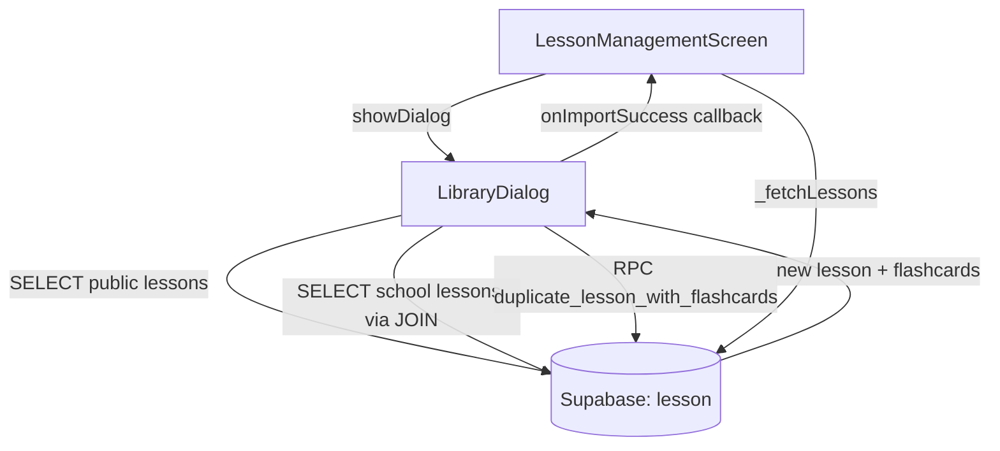

# Design Document: Library Feature for Serene Learning

## Overview

The Library feature introduces a shared lesson repository to the Serene Learning platform. Teachers can browse lessons marked `public` (visible to all teachers) or `school` (visible only within the same school), and import any of them into their current class with a single tap. The import is handled entirely server-side via the `duplicate_lesson_with_flashcards` Supabase RPC, which deep-copies the lesson and all its flashcards and resets visibility to `private` on the new copy.

The existing per-lesson "copy to another class" workflow (`_duplicateLessonWithContent`, `_copyFile`, `_showImportDialog`, and the `Icons.content_copy` card action) is removed entirely. The Library Dialog becomes the single import path.

---

## Architecture

The feature follows the existing pattern in the codebase: a Flutter `StatefulWidget` screen backed directly by the Supabase Flutter SDK. No additional state management layer (e.g., BLoC, Riverpod) is introduced, keeping the change minimal and consistent with the rest of the app.



**Key design decisions:**

- `LibraryDialog` is a separate file (`lib/screens/teacher/library_dialog.dart`) to keep `lesson_screen.dart` focused on CRUD for the current class.
- The dialog receives `classId` and `onImportSuccess` as constructor parameters, making it reusable and independently testable.
- All duplication logic lives in the Supabase RPC; the Dart layer only calls it and reacts to success/failure.
- The school-scoped query uses a JOIN on `class` to avoid fetching the full class list client-side.

---

## Components and Interfaces

### LibraryDialog (`lib/screens/teacher/library_dialog.dart`)

```dart
class LibraryDialog extends StatefulWidget {
  final int classId;
  final VoidCallback onImportSuccess;

  const LibraryDialog({
    super.key,
    required this.classId,
    required this.onImportSuccess,
  });
}
```

**State fields:**
- `List<Map<String, dynamic>> _lessons` — combined public + school lessons
- `bool _isLoading` — true while fetching or during RPC call
- `String? _errorMessage` — non-null when the initial fetch fails

**Methods:**

| Method | Responsibility |
|---|---|
| `_fetchLibraryLessons()` | Fetches current user's `schoolid` from `profile`, runs both queries, deduplicates by `lessonid`, sets `_lessons` |
| `_importLesson(int lessonId)` | Calls `duplicate_lesson_with_flashcards` RPC; on success calls `onImportSuccess`; on failure shows error SnackBar |
| `_buildLessonList()` | Renders scrollable `ListView` of lessons |
| `_buildEmptyState()` | Renders "no shared lessons" message |
| `_buildErrorState()` | Renders error message with dismiss button |
| `_buildLoadingIndicator()` | Centered `CircularProgressIndicator` |

### Changes to `LessonManagementScreen`

**Removals:**
- `_copyFile()` method
- `_duplicateLessonWithContent()` method
- `_showImportDialog()` method
- `_buildActionSegment` call for `Icons.content_copy` in `_buildLessonList()`

**Additions:**
- `_showLibraryDialog()` method — calls `showDialog` with `LibraryDialog`
- "Add from Library" `IconButton` with `Icons.add_circle_outline`, placed adjacent to the existing FAB

**FAB area layout** (using `Column` of FABs or a `Stack`):

```dart
floatingActionButton: Column(
  mainAxisSize: MainAxisSize.min,
  crossAxisAlignment: CrossAxisAlignment.end,
  children: [
    // Add from Library
    FloatingActionButton.extended(
      heroTag: 'library',
      onPressed: _showLibraryDialog,
      label: const Text("Add from Library", style: TextStyle(color: Color(0xFF1D5A71))),
      icon: const Icon(Icons.add_circle_outline, color: Color(0xFF1D5A71)),
      backgroundColor: const Color(0xFFa5ceeb),
    ),
    const SizedBox(height: 12),
    // Add Lesson (existing)
    FloatingActionButton.extended(
      heroTag: 'addLesson',
      onPressed: _showCreateLessonDialog,
      label: const Text("Add Lesson", style: TextStyle(color: Color(0xFF1D5A71))),
      icon: const Icon(Icons.add, color: Color(0xFF1D5A71)),
      backgroundColor: const Color(0xFFa5ceeb),
    ),
  ],
),
```

---

## Data Models

No new Dart model classes are introduced. The feature works with raw `Map<String, dynamic>` maps from Supabase, consistent with the existing codebase pattern.

**Relevant Supabase schema:**

```
lesson
  lessonid    int  PK
  classid     int  FK → class.classid
  lessontitle text
  visibility  text  ('private' | 'school' | 'public')
  created_at  timestamptz

flashcard
  flashcardid  int  PK
  lessonid     int  FK → lesson.lessonid
  signmeaning  text
  imgurl       text
  videourl     text

class
  classid    int  PK
  classname  text
  schoolid   int  FK

profile
  userid    uuid  FK → auth.users
  schoolid  int   FK
  role      text
```

**Library fetch queries:**

```sql
-- Public lessons
SELECT lessonid, lessontitle, visibility, classid
FROM lesson
WHERE visibility = 'public';

-- School-scoped lessons
SELECT l.lessonid, l.lessontitle, l.visibility, l.classid
FROM lesson l
JOIN class c ON l.classid = c.classid
WHERE l.visibility = 'school'
  AND c.schoolid = :user_schoolid;
```

Results are merged client-side and deduplicated by `lessonid` (a lesson could theoretically match both queries if data is inconsistent).

**RPC call:**

```dart
await Supabase.instance.client.rpc(
  'duplicate_lesson_with_flashcards',
  params: {
    'target_lesson_id': lessonId,
    'target_class_id': widget.classId,
  },
);
```

---

## Correctness Properties

*A property is a characteristic or behavior that should hold true across all valid executions of a system — essentially, a formal statement about what the system should do. Properties serve as the bridge between human-readable specifications and machine-verifiable correctness guarantees.*

### Property 1: School scoping exclusion

*For any* teacher with a given `schoolid`, the set of lessons returned by the Library Dialog must contain no lessons where `visibility = 'school'` and the lesson's class belongs to a different school.

**Validates: Requirements 3.2**

---

### Property 2: All fetched lessons are displayed

*For any* non-empty list of lessons returned by the fetch queries, every lesson in that list must appear as a rendered item in the Library Dialog's scrollable list.

**Validates: Requirements 3.3**

---

### Property 3: RPC invoked with correct parameters

*For any* lesson selected from the Library Dialog, the `duplicate_lesson_with_flashcards` RPC must be called with `target_lesson_id` equal to the selected lesson's `lessonid` and `target_class_id` equal to the dialog's `classId`.

**Validates: Requirements 4.1**

---

### Property 4: Import idempotency — two imports produce independent copies

*For any* lesson imported twice via the RPC, the result must be two distinct lesson records (different `lessonid` values) with no shared flashcard records between them.

**Validates: Requirements 4.1, 4.2**

---

### Property 5: Visibility reset on import

*For any* lesson with `visibility = 'public'` or `visibility = 'school'`, after a successful RPC call the newly created lesson copy must have `visibility = 'private'`.

**Validates: Requirements 4.2**

---

### Property 6: Flashcard completeness on import

*For any* lesson with N flashcards, after a successful RPC call the newly created lesson copy must also have exactly N flashcards.

**Validates: Requirements 4.2**

---

## Error Handling

| Scenario | Behavior |
|---|---|
| `profile` fetch fails (can't get `schoolid`) | `_fetchLibraryLessons` catches the exception, sets `_errorMessage`, renders error state with dismiss button |
| Lesson query fails | Same as above — error state shown, dialog stays open |
| RPC call fails | `_importLesson` catches the exception, shows error `SnackBar` via `ScaffoldMessenger`, dialog stays open for retry |
| RPC call succeeds | `onImportSuccess` callback fires: dialog is dismissed by the caller (`LessonManagementScreen._showLibraryDialog`), success `SnackBar` is shown, `_fetchLessons()` is called |
| Empty result set | `_lessons` is empty, `_buildEmptyState()` renders "No shared lessons available" message |

The dialog never auto-dismisses on error, giving the teacher the option to retry or manually close.

---

## Testing Strategy

### Unit / Widget Tests

Focus on specific examples, edge cases, and error conditions:

- `LessonManagementScreen` does not contain `_duplicateLessonWithContent` or `_copyFile` (compile-time enforcement + widget test)
- `LessonManagementScreen` lesson cards do not render `Icons.content_copy`
- "Add from Library" button is present and tapping it opens `LibraryDialog`
- `LibraryDialog` shows empty state when query returns zero results
- `LibraryDialog` shows error state when query throws
- `LibraryDialog` shows loading indicator while RPC is in progress and taps are disabled
- On RPC success: dialog dismissed, SnackBar shown, `_fetchLessons` called
- On RPC failure: dialog stays open, error SnackBar shown

### Property-Based Tests

Use [dart_test](https://pub.dev/packages/test) with [fast_check](https://pub.dev/packages/fast_check) (or equivalent Dart PBT library). Each test runs a minimum of **100 iterations**.

Tag format: `// Feature: serene-learning, Property {N}: {property_text}`

**Property 1 — School scoping exclusion**
Generate random sets of lessons with mixed `visibility` and `schoolid` values. For a given teacher `schoolid`, assert that `_fetchLibraryLessons` (with mocked Supabase) never returns a lesson where `visibility = 'school'` and `schoolid != teacher_schoolid`.
```
// Feature: serene-learning, Property 1: school-visibility lessons from other schools never appear
```

**Property 2 — All fetched lessons displayed**
Generate a random list of lesson maps. Mock the fetch to return that list. Render `LibraryDialog` and assert every lesson's `lessontitle` appears in the widget tree.
```
// Feature: serene-learning, Property 2: all fetched lessons appear in the rendered list
```

**Property 3 — RPC invoked with correct parameters**
Generate random `lessonId` and `classId` values. Simulate a tap on the corresponding lesson tile. Assert the mocked RPC was called with exactly those parameter values.
```
// Feature: serene-learning, Property 3: RPC called with correct target_lesson_id and target_class_id
```

**Property 4 — Import idempotency**
Against a real or emulated Supabase instance, call the RPC twice for the same `target_lesson_id`. Assert the two resulting `lessonid` values differ and that no `flashcardid` appears in both copies.
```
// Feature: serene-learning, Property 4: two imports of the same lesson produce independent copies
```

**Property 5 — Visibility reset**
For any lesson with `visibility` in `{'public', 'school'}`, call the RPC and fetch the new lesson record. Assert `visibility = 'private'`.
```
// Feature: serene-learning, Property 5: imported lesson always has visibility = 'private'
```

**Property 6 — Flashcard completeness**
For any lesson with a random number of flashcards (0–N), call the RPC and count flashcards on the new lesson. Assert the count equals the original.
```
// Feature: serene-learning, Property 6: imported lesson has same flashcard count as original
```

Properties 4, 5, and 6 require integration-level tests against a Supabase emulator or test database. Properties 1, 2, and 3 can be pure unit/widget tests with mocked Supabase responses.
